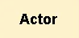

# 도메인 주도 설계 (Domain-Driven Design) 용어 설명

## 도메인 이벤트

- 과거 시제 동사 형태로 표현
  - ex) 주문이 생성됨, 결제가 완료됨
- 도메인 전문가가 정의한 이벤트
- 시스템에서 중요한 변화를 나타내는 사건, 결과

## 커멘드

- 현재 시제로 표현
  - ex) 주문 생성, 결제 완료
- 행동, 결정 등의 값들에 대한 정의
- 특정 주체가 요청하는 행위
- UI 혹은 API
- 상태 변경을 요청할 수 있다.
- 시스템에서 어떤 행동을 일으키는 요청 또는 명령

## 에그리게이트

- 비즈니스 로직 처리의 도메인 객체 덩어리
- 서로 연결된 하나 이상의 Entity 및 VO(Value Object)의 집합체
- 상태가 변경되는 데이터 묶음
- 도메인 이벤트와 커멘드가 처리하게 되는 데이터
  - ex) 주문, 결제

## 액터

- command 를 내리는 주체

## External Service

- 외부 시스템
- 시스템 호출(Rest)
  - ex) 이메일 발송 시스템, 결제 시스템

## 모델

- CQRS 패턴에서 등장한 표현
- 행위를 결정하기 위해 유저가 참고하는 데이터
- 데이터 프로젝션이 필요하다.
- Command 를 수행함에 있어 '결정 근거' 가 되는 데이터

## 정책

- 이벤트가 발생한 후 연이어 발생하는 액션

## 바운디드 컨텍스트(Bounded Context)
- 도메인 그 자체
- 여러개의 액터, 커맨드, 이벤트, 어그리게이트 등으로 구성
- 바운디드 컨텍스트 단위로 서비스를 구성할 수 있다.